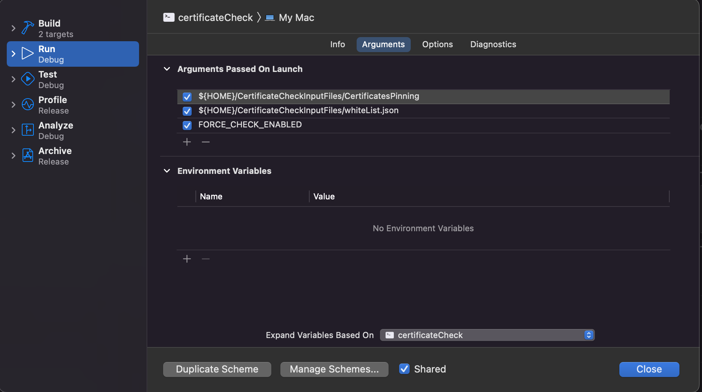

# DOCUMENTAZIONE

# Introduzione
L'utility oggetto della presente documentazione è un command line tool che serve a verificare la validità temporale dei certificati.

## Utilizzo
Il comando prende in ingresso tre argomenti:

 - il path della directory in cui si trovano i certificati 
 - il path del file json che contiene la whiteList
 - un flag opzionale "FORCE_CHECK_ENABLED" che, se presente, rende obbligatorio almeno un certificato da valutare. 
 
 tali parametri possono essere configurati direttamente nello schema di lancio del progettino di prova contenuto nel repository dell'utility. Di seguito uno screenshot di esempio:
 
 
 
Nel root directory del repository è presente la cartella "CertificateCheckInputFiles". Tale cartella costituisce un esempio di alberatura di file da fornire in ingresso all'utility. Pertanto l'utente può copiare questa cartella nella propria HOME direstory e lanciare l'utlity.

Per una descrizione della sintassi del file json contentente la whiteList vedere il seguente link: 

[Sintassi del json](docs/SintassiJson.md)
