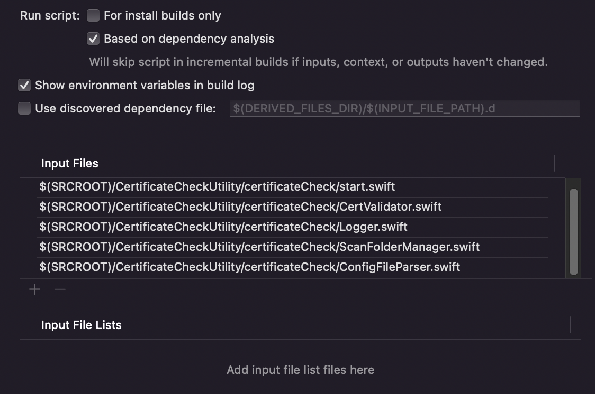

# Integrazione con il progetto
L'integrazione con un progetto XCode avviene creando una nuova  Build Phase e copiando in essa il seguente script:

    xcrun --sdk macosx swiftc -parse-as-library $SCRIPT_INPUT_FILE_0 \
        $SCRIPT_INPUT_FILE_1 \
        $SCRIPT_INPUT_FILE_2 \
        $SCRIPT_INPUT_FILE_3 \
        $SCRIPT_INPUT_FILE_4   -o CompiledCheckScript
        ./CompiledCheckScript ${PROJECT_DIR}/${PROJECT}/CertificatesPinning "CertificateCheckInputFiles/configuration-${SCHEME_NAME_CONFIG}.json" FORCE_CHECK_ENABLED
            
    status=$?

    rm -f ./CompiledCheckScript
            
    if [ $status -eq 0 ]
    then
        echo "SCRIPT CERTIFICATE SUCCESS!!!"
        exit 0
    else
        echo "SCRIPT CERTIFICATE FAILED!!!"
        exit 1  
    fi

Dove la lista di file di input sono definiti tramite interfaccia di XCode:

  
 
 Come si può vedere lo script prende in ingresso la lista dei file swift della compilation utility, li compila per piattaforma macos e lancia l'eseguibile così ottenuto con gli opportuni argomenti:
  
- il path dela cartella dei certificati espressa in funzione della directory root del progetto
- il path relativo del file di configurazione, espresso in funzione del nome della Build Configuration per la quale si sta effettuando la compilazione
- il flag FORCE_CHECK_ENABLED per il controllo sulla presenza di almeno un certificato da esaminare nella directory dei certificati
 
 I file del codice della compilation utility possono essere inseriti nell'alberatura della directory del progetto principale tramite un git submodule, piuttosto che trovarsi nello stesso repository del progetto client. Inoltre tale submodule deve puntare al branch di release (attualmente "release_0_1_0").

